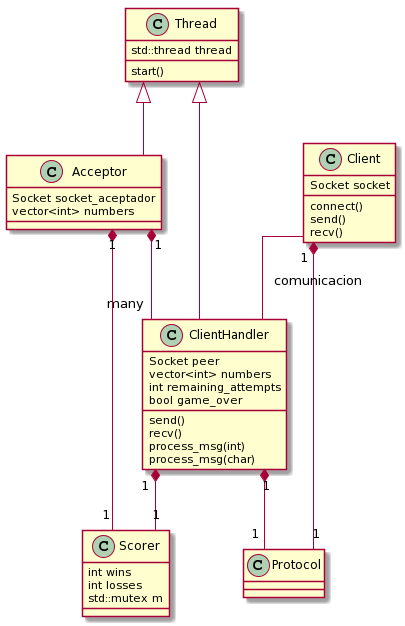

# TP3

Trabajo Practico N°3 Taller de Programación 1 (75.42) FIUBA

**Alumno:** Julián Crespo

**Padrón:** 100490

**Repositorio:** https://github.com/komod0/tp3

---

### <u>Diseño:</u>

El trabajo se puede separar en tres partes, por un lado se tiene la parte del cliente y toda la lógica que conlleva(procesamiento del input, validaciones sobre lo ingresado, envío y recepción de mensajes, conexión al socket, etc), por otro lado se tiene a la parte del servidor que se encarga de contestarle al cliente, manejar la lógica de contar la cantidad de aciertos y contar la partida como perdida o ganada e incrementar el contador correspondiente en cada caso, finalmente se tiene la parte del servidor que se encarga de aceptar clientes y lanzar hilos en consecuencia para los manejen.

Se adjunta incluye una explicación de cada una de estas partes y un diagrama(no exhaustivo) de las clases presentes en el TP:

###### Cliente

El cliente cuenta con un socket y con un objeto Protocolo que es quien se encarga de encodear cualquier mensaje que se quiera enviar y decodificar cualquier mensaje que llegue, es el protocolo quien sabe _como_ recibir los mensajes(por ejemplo para recibir sabe que primero tiene que recibir 4 bytes con la longitud del string entrante). El cliente recibe input del stdin y lo procesa linea a linea, realiza los chequeos necesarios, que sea uno de los comandos especificados, si es un numero que sea representable en 2 bytes, etc. Para el envío y recepción de mensajes se cuenta con funciones como `send()` y `recv()` que actúan como wrappers de las funciones análogas de la clase Socket.

###### ClientHandler

Esta clase es la parte del servidor que se encarga de responderle al cliente, nuevamente se cuenta con un socket _peer_, un objeto Protocolo y nuevamente el protocolo es quien se encarga de la lógica, recibiendo los mensajes y llamando a las funciones de procesamiento que correspondan, por ejemplo si se envío 'h' se llama a la función process_msg(char) que se encarga de generar una respuesta, análogamente si se recibe un numero se llama a process_msg(int) que se encarga de procesar el numero, hacer las validaciones necesarias(como fijarse que el numero sea de 3 cifras, que no sean repetidas, etc) y en caso de que sea todo correcto se procesa el numero y se califica el intento comparando con el numero a adivinar

###### Acceptor

Es la parte del servidor que se encarga de aceptar nuevos clientes, lanzar el handler con el numero a adivinar correspondiente y de eliminar de la lista los clientes que ya hayan terminado, la clase cuenta con un Scorer que es quien contiene información sobre la cantidad de partidas ganadas y perdidas hasta el momento, cuando llega un nuevo cliente se crea el handler y se le pasa una referencia a este Scorer, dado que los handlers operan concurrentemente, tenemos la posibilidad de race conditions, por lo que el Scorer cuenta con un mutex que protege sus miembros, por lo que actúa como un monitor.

La clase se implemento de manera que en su salida se elimine cada uno de los clientes de la lista(esperando a que terminen las correspondientes partidas) se cierre el socket aceptador y que se imprima las estadísticas de las partidas.

Teniendo en cuenta esto, que la unica parte del trabajo donde se usa memoria dinámica es en la lista de clientes(para evitar posibles problemas en el redimensionamiento del vector) y la destrucción/cierre automático de los sockets se evitaron enormemente los leaks tanto de file descriptors abiertos como de memoria sin liberar.

###### Socket

Como anexo a las anteriores tres partes se migró la clase socket de su versión en C que se uso para el TP1,  en su mayoría la implementación se mantuvo relativamente igual, aunque se cambiaron algunas cosas como implementar el constructor por movimiento del mismo, se modelo a la clase como una clase RAII, en su destrucción se cierra el file descriptor asociado si este esta aun abierto, esto evito en gran parte que queden file descriptors sin cerrar y simplifico mucho el código ya que no hay que estar cerrandolos explicitamente en el codigo.
